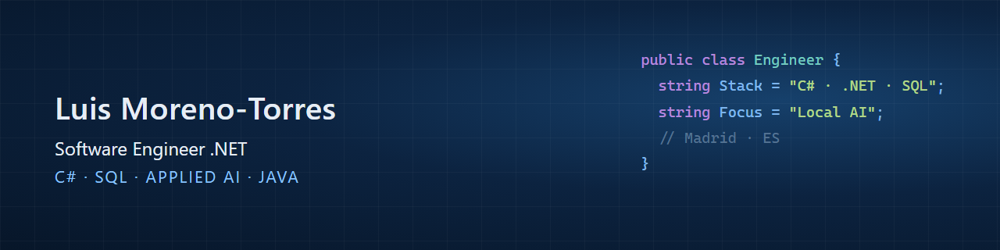

  

  
  
  
  

Software engineer at the **Registro Mercantil de Madrid** (Madrid Companies Registry) since June 2026,
building web applications with **C#, ASP.NET Web Forms and SQL** and integrating **locally hosted AI
services** from C#. Backend-leaning by background, with **Java** and the **Spring Boot** ecosystem.
Methodical and focused on writing reliable, well-documented code.

---

## Currently

- 🏛️ Developing web applications with **C#**, **ASP.NET Web Forms**, **.NET** and **SQL** at the Registro Mercantil de Madrid
- 🤖 Integrating **local AI models** into .NET applications
- 🧠 Building **GAIA**, my personal AI assistant that orchestrates local and cloud models with voice, image generation and automation
- 🎮 Evolving **GamerZone**, my real-time communication platform (hosting currently paused)

## Featured projects

### GamerZone — real-time communication platform

A full communication platform built and deployed end to end. It ran in production on a cloud VM
with real users; hosting is currently paused.

- Servers with roles and granular permissions, text channels and group direct messages
- **WebRTC** voice calls with screen sharing, resilient to reconnects and background tabs
- **Web Push** notifications with inline reply, installable **PWA**, and a Windows desktop app
  (**Electron**) with auto-updates
- Deployed on **Oracle Cloud** behind **Caddy** with automatic TLS

`Node.js` · `WebSockets` · `WebRTC` · `PWA + Web Push` · `Electron` · `Oracle Cloud + Caddy`

### GAIA — personal AI assistant

A personal assistant that orchestrates several AI models, both local and cloud-based: chat, voice,
image generation, model management and task automation from a single web interface.

`Local LLMs` · `Cloud AI APIs` · `Voice` · `Image generation` · `Automation`

---

## More projects

| Project | What it is | Stack |
| --- | --- | --- |
| [blazing-pizza-blazor](https://github.com/BRUSKYMIL/blazing-pizza-blazor) | Microsoft's BlazingPizza workshop end to end | Blazor WASM · ASP.NET Core · EF Core |
| [Bookings_App](https://github.com/BRUSKYMIL/Bookings_App) | Session booking web application | Spring Boot · JPA/Hibernate · Thymeleaf · MySQL |
| [dbd-perks-maui](https://github.com/BRUSKYMIL/dbd-perks-maui) | Cross-platform app with Shell navigation | .NET MAUI · C# |
| [wpf-login-ui](https://github.com/BRUSKYMIL/wpf-login-ui) | Login screen with custom borderless chrome | WPF · XAML · C# |
| [Music-Player](https://github.com/BRUSKYMIL/Music-Player) | Android music player with persistent playlist | Kotlin · Android |
| [portfolio](https://github.com/BRUSKYMIL/portfolio) | Bilingual EN/ES portfolio, no build step | JavaScript · React · Netlify |

---

## Stack

**Languages**

**Frameworks & runtimes**

**Data & AI**

**Tooling**

---

## Background

| Period | Organisation | Role |
| --- | --- | --- |
| Jun 2026 — Present | **Registro Mercantil de Madrid** | Software Engineer .NET — C# / ASP.NET Web Forms / SQL / local AI |
| 2025 | **Indra** | Software Developer Java — Spring Boot, Spring Framework, GitHub workflows |
| 2023 — 2025 | **CEU FP** | Higher Vocational Degree — Multi-Platform Application Development (DAM) |
| 2022 — 2023 | — | Baccalaureate in Technological Sciences |

---

## Contact

Interested in discussing a role, a project, or a technical question?

- **Portfolio** — [luismoreno-torres.netlify.app](https://luismoreno-torres.netlify.app)
- **LinkedIn** — [linkedin.com/in/luismtm](https://www.linkedin.com/in/luismtm)
- **Email** — [luismtmdam@gmail.com](mailto:luismtmdam@gmail.com)
- **Languages** — Spanish (native) · English (C1)
